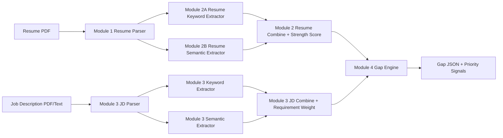

# SkillForge AI (ArtPark Hacks)

Adaptive onboarding engine for role-specific competency acceleration.

## Problem
Traditional onboarding is static: the same learning track is assigned to everyone, which wastes time for strong candidates and overwhelms beginners.

This project builds a capability-aware pipeline:
`Resume + JD -> structured skills + strength scoring -> gap analysis -> targeted upskilling direction`.

## What This Repo Implements Today
The current codebase already supports the core MVP path in JSON form:

1. Resume parse extraction (robust PDF parsing + sectioning)
2. Resume skill extraction via keyword + semantic layers
3. JD parse extraction
4. JD skill extraction and requirement weighting (keyword + semantic)
5. Gap extraction between candidate and role requirements

This is the strongest hackathon-safe flow for a 24-48h build.

## End-to-End Pipeline
```text
Resume PDF + JD PDF
	-> Module 1: Resume Parse Extraction
	-> Module 2: Resume Keyword + Semantic Skill Engine
	-> Module 3: JD Parse + JD Keyword/Semantic + Requirement Scoring
	-> Module 4: Gap Extraction (Resume vs JD)
	-> JSON outputs for explainable decisioning and UI
```

## Architecture


## Module Breakdown (Detailed)

### Module 1: Document Intake + Parse Extraction
Path: `module_1_Parse_extractor/main_extraction.py`

Input:
- Resume PDF

Core approach:
- Uses `PyMuPDF` + fallback `pdfplumber`
- Heading-aware section splitting (`skills`, `projects`, `experience`, `education`, etc.)
- Hyperlink extraction and table extraction

Output JSON shape (conceptual):
```json
{
	"raw_text": "...",
	"sections": {
		"skills": ["..."],
		"projects": ["..."],
		"experience": ["..."],
		"education": ["..."]
	},
	"hyperlinks": ["https://..."],
	"tables": []
}
```

Pipeline output location:
- `output/resume/module_1/<resume_name>.txt`

### Module 2: Resume Skill Engine (Keyword + Semantic)

#### Module 2A: Keyword Extraction
Path: `module2/module2_Keyword/lay1.py`

Core approach:
- Taxonomy-driven exact/alias skill matching
- Section-aware context tracking
- Mention counting and confidence score

Output file:
- `output/resume/module_2/A/layer_a_keywords.json`

Output JSON shape (conceptual):
```json
{
	"python": {
		"confidence": 1.0,
		"source": ["keyword"],
		"mentions": 3,
		"contexts": ["skills", "project"],
		"category": "hard_skill",
		"taxonomy_category": "Programming",
		"sub_category": "Language"
	},
	"__meta__": {
		"skills_count": 120
	}
}
```

#### Module 2B: Semantic Extraction
Path: `module2/module2_semantic/generate_resume_skill_json.py`

Core approach:
- Embeddings with `SentenceTransformer(all-MiniLM-L6-v2)`
- Detects semantic equivalence where exact keywords are missing
- Fuses keyword evidence + semantic signals

Output file:
- `output/resume/module_2/B/layer_a_semantic_resume.json`

Why this matters:
- Example: "built image recognition pipeline" can map toward "computer vision" even if exact phrase is absent.

#### Module 2 Combine: Experience Strength Engine
Path: `module2/combine.py`

Formula implemented:
- `SkillScore = SectionWeight + FrequencyWeight + ContextWeight (+ EducationScore)`
- Confidence fusion: `0.6 * keyword_confidence + 0.4 * semantic_confidence`

Output file:
- `output/resume/module_2/Module_2_combined.json`

Output JSON includes:
- `resulting_score` (0-10)
- `strength_breakdown`
- confidence + source trace

### Module 3: JD Requirement Intelligence

#### JD Parse Extraction
Paths:
- `module_3_jd/main_extraction.py`
- `module_3_jd/run_jd_parser.py`

Extracts structured JD sections such as:
- `required_skills`, `preferred_skills`, `qualifications`, `experience`, `education`, etc.

Outputs:
- `output/jd/module_3/jd_resulting_text.txt`
- `output/jd/module_3/jd_parsed_output.json`

#### JD Keyword + Semantic + Weighted Scoring
Path: `module_3_jd/jd_req/run_jd_scoring_pipeline.py`

Core approach:
- Runs keyword layer + semantic layer on JD text
- Detects priority language like: `mandatory`, `must have`, `required`, `preferred`, `good to have`
- Produces requirement weights with phrase and context signals

Outputs:
- `output/jd/module_3/module2_Keyword/layer_a_keywords.json`
- `output/jd/module_3/module2_semantic/layer_a_semantic_resume.json`
- `output/jd/module_3/COMBINED/layer_a_combined_scored.json`

### Module 4: Gap Extraction Engine
Path: `module4/gapengine.py`

Inputs:
- Resume combined skill JSON
- JD combined weighted JSON

Core logic:
- Compares normalized resume score vs JD score per skill
- We incorporate candidate seniority and JD expectations using dynamic level normalization.
- Produces gap score + classification + action priority

Gap output file:
- `output/module_4/gapengine_output.json`

Output JSON shape (conceptual):
```json
{
	"sql": {
		"resume_score": 3.2,
		"jd_score": 8.4,
		"gap_score": -5.2,
		"status": "matched",
		"level": "Moderate Gap",
		"action": "important",
		"category": "hard_skill",
		"taxonomy_category": "Data"
	}
}
```

## Run The Full Pipeline
From workspace root (`/home/kirat/artpark`):

```bash
python run_pipeline.py
```

Default pipeline inputs in `run_pipeline.py`:
- Resume: `main_Resume-2.pdf`
- JD: `Machine-Learning-Engineer.pdf`

Main generated outputs:
- `output/resume/module_1/*.txt`
- `output/resume/module_2/A/layer_a_keywords.json`
- `output/resume/module_2/B/layer_a_semantic_resume.json`
- `output/resume/module_2/Module_2_combined.json`
- `output/jd/module_3/jd_parsed_output.json`
- `output/jd/module_3/COMBINED/layer_a_combined_scored.json`
- `output/module_4/gapengine_output.json`

## Suggested Local Setup
Python 3.10+ is recommended.

Install dependencies:
```bash
pip install -r requirements.txt
```

Notes:
- Semantic modules auto-select CPU/CUDA.
- If `sentence-transformers` is missing, semantic extraction will fail until installed.

## Why This Fits Hackathon Judging
This implementation aligns with what judges usually reward:

1. Technical depth: dual-layer extraction (keyword + semantic), weighted scoring, structured gap logic
2. Product clarity: deterministic JSON contracts at each stage
3. Explainability: confidence, mentions, contexts, breakdown, and priority labels are all explicit
4. Reliability: robust parser strategy with fallback extraction

## Next High-Impact Extensions
To complete the full finalist blueprint on top of this repo:

1. Profession mapping with O*NET embeddings and role similarity
2. Adaptive learning path generation using dependency graph (NetworkX shortest path)
3. Resource recommendation layer from a fixed trusted catalog
4. Streamlit dashboard with fit score, skill radar, timeline, and reasoning trace cards
5. Confidence score surfaces per gap and per recommendation

## Team Build Order (Practical)
If building under time pressure, use this order:

1. Keep Module 1 to Module 4 stable and demoable first
2. Add reasoning trace text generation from gap JSON
3. Add UI shell (upload + dashboard)
4. Add learning path graph module
5. Add profession mapping only if time remains
