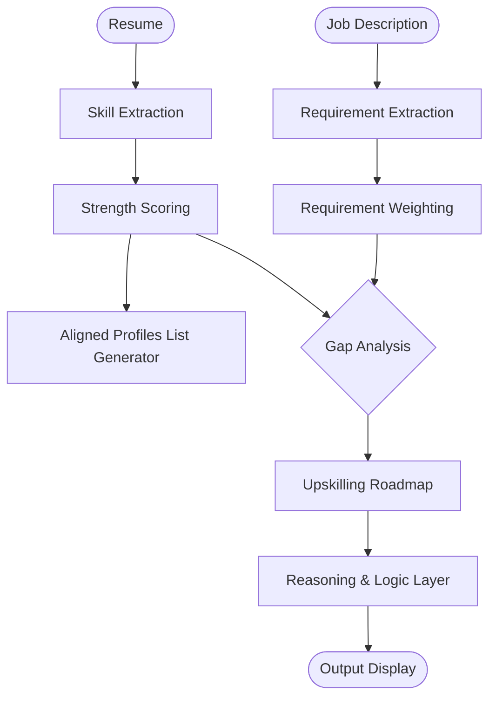
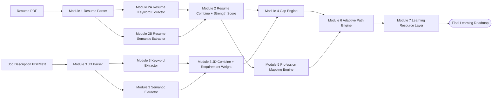

# SkillForge AI (ArtPark Hacks)

An AI-driven, explainable onboarding engine that converts unstructured candidate profiles into personalized, role-specific learning pathways
> From resume parsing to career pathway generation — fully explainable, modular, and adaptive.
## Problem
Traditional onboarding is static: the same learning track is assigned to everyone, which wastes time for strong candidates and overwhelms beginners.

The system implements a multi-stage, capability-aware intelligence pipeline:


## Why This Matters

- Eliminates redundant training for experienced hires
- Prevents skill gaps for beginners through structured progression
- Enables explainable decision-making in AI-driven onboarding
- Bridges the gap between hiring signals and real competency development

## Core Capabilities Implemented

1. Resume parse extraction (robust PDF parsing + sectioning)
2. Resume skill extraction via keyword + semantic layers
3. JD parse extraction
4. JD skill extraction and requirement weighting (keyword + semantic)
5. Gap extraction between candidate and role requirements
6. Profession mapping based on skillset extracted from resume
7. Roadmap generation via dependency-aware inference over skill mastery graphs and current capability state
8. Curated and attached relevant learning resources for each identified skill gap

`Each stage produces deterministic, structured JSON outputs enabling traceability and explainable decision-making.`

## Key Innovation

Unlike traditional resume parsers, this system:
- Understands skill relationships via dependency graphs
- Adapts learning paths dynamically based on current capability
- Provides full explainability for every recommendation
- Separates skill understanding (profession mapping) from gap evaluation to ensure context-aware recommendations

## End-to-End Pipeline
```text
Resume PDF + JD PDF
	-> Module 1: Resume Parse Extraction
	-> Module 2: Resume Keyword + Semantic Skill Engine
	-> Module 3: JD Parse + JD Keyword/Semantic + Requirement Scoring
	-> Module 4: Gap Extraction (Resume vs JD)
	-> Module 5: Profession Mapping Engine (O*NET Alignment)
	-> Module 6: Adaptive Path Engine (NetworkX Dependency Graph)
	-> Module 7: Learning Resource Layer (Curated Roadmap)
	-> JSON outputs for explainable decisioning and UI
	-> Output on User Dashboard
```
## Architecture


## Module Breakdown (Detailed)

### Module 1: Document Intake + Parse Extraction
Path: `module_1_Parse_extractor/main_extraction.py`

Input:
- Resume PDF

Core approach:
- Uses `PyMuPDF` + fallback `pdfplumber`
- Heading-aware section splitting (`skills`, `projects`, `experience`, `education`, etc.)
- Hyperlink extraction and table extraction

Output JSON shape (conceptual):
```json
{
	"raw_text": "...",
	"sections": {
		"skills": ["..."],
		"projects": ["..."],
		"experience": ["..."],
		"education": ["..."]
	},
	"hyperlinks": ["https://..."],
	"tables": []
}
```

Pipeline output location:
- `output/resume/module_1/<resume_name>.txt`

### Module 2: Resume Skill Engine (Keyword + Semantic)

#### Module 2A: Keyword Extraction
Path: `module2/module2_Keyword/lay1.py`

Core approach:
- Taxonomy-driven exact/alias skill matching
- Section-aware context tracking
- Mention counting and confidence score

Output file:
- `output/resume/module_2/A/layer_a_keywords.json`

Output JSON shape (conceptual):
```json
{
	"python": {
		"confidence": 1.0,
		"source": ["keyword"],
		"mentions": 3,
		"contexts": ["skills", "project"],
		"category": "hard_skill",
		"taxonomy_category": "Programming",
		"sub_category": "Language"
	},
	"__meta__": {
		"skills_count": 120
	}
}
```

#### Module 2B: Semantic Extraction
Path: `module2/module2_semantic/generate_resume_skill_json.py`

Core approach:
- Embeddings with `SentenceTransformer(all-MiniLM-L6-v2)`
- Detects semantic equivalence where exact keywords are missing
- Fuses keyword evidence + semantic signals

Output file:
- `output/resume/module_2/B/layer_a_semantic_resume.json`

Why this matters:
- Example: "built image recognition pipeline" can map toward "computer vision" even if exact phrase is absent.

#### Module 2C : Fusion & Experience Strength Engine
Path: `module2/combine.py`

Formula implemented:
- `SkillScore = SectionWeight + FrequencyWeight + ContextWeight (+ EducationScore)`
- Confidence fusion: `0.6 * keyword_confidence + 0.4 * semantic_confidence`

Output file:
- `output/resume/module_2/Module_2_combined.json`

Output JSON includes:
- `resulting_score` (0-10)
- `strength_breakdown`
- confidence + source trace

### Module 3: JD Requirement Intelligence

#### JD Parse Extraction
Paths:
- `module_3_jd/main_extraction.py`
- `module_3_jd/run_jd_parser.py`

Extracts structured JD sections such as:
- `required_skills`, `preferred_skills`, `qualifications`, `experience`, `education`, etc.

Outputs:
- `output/jd/module_3/jd_resulting_text.txt`
- `output/jd/module_3/jd_parsed_output.json`

#### JD Keyword + Semantic + Weighted Scoring
Path: `module_3_jd/jd_req/run_jd_scoring_pipeline.py`

Core approach:
- Runs keyword layer + semantic layer on JD text
- Detects priority language like: `mandatory`, `must have`, `required`, `preferred`, `good to have`
- Produces requirement weights with phrase and context signals

Outputs:
- `output/jd/module_3/module2_Keyword/layer_a_keywords.json`
- `output/jd/module_3/module2_semantic/layer_a_semantic_resume.json`
- `output/jd/module_3/COMBINED/layer_a_combined_scored.json`

### Module 4: Gap Extraction Engine
Path: `module4/gapengine.py`

Inputs:
- Resume combined skill JSON
- JD combined weighted JSON

Core logic:
- Compares normalized resume score vs JD score per skill
- We incorporate candidate seniority and JD expectations using dynamic level normalization.
- Produces gap score + classification + action priority

Gap output file:
- `output/module_4/gapengine_output.json`

`Gap score is computed as (JD Requirement − Resume Strength), where higher positive values indicate stronger skill gaps and higher priority for upskilling.`

Output JSON shape (conceptual):
```json
{
	"sql": {
		"resume_score": 3.2,
		"jd_score": 8.4,
		"gap_score": -5.2,
		"status": "exceeds",
		"level": "Moderate Gap",
		"action": "important",
		"category": "hard_skill",
		"taxonomy_category": "Data"
	}
}
```

### Module 5: Profession Mapping Engine
Path: `module5/profession_mapper.py`

Inputs:
- Resume combined skill scores

Core approach:
- Uses O*NET-inspired profession dataset
- Matches resume skill vector against profession role vectors
- Uses cosine similarity to predict best-fit roles

Output file:
- `output/module_5/profession_mapping_output.json`

Output JSON includes top-matching professions with similarity scores and skill matches/gaps.

### Module 6: Adaptive Path Engine
Path: `module6/graph_info.py`

Inputs:
- Gap JSON (Module 4 output)
- Profession mapping (Module 5 output)
- Skill dependency graph and dataset

Core approach:
- Constructs a directed skill dependency graph and performs prerequisite-aware scheduling using topological ordering to generate optimized learning sequences
- Computes priority formula: `Priority = Gap × JD Importance × Dependency Weight`
- Generates temporally structured (week-wise) learning roadmaps using dependency-aware topological scheduling
- Ensures prerequisites are taught before dependent skills

Output file:
- `output/module_6/adaptive_path_output.json`

Key features:
- Skill dependency graph ensures prerequisites are taught first
- Difficulty scoring per skill
- Resource attachment from dataset

### Module 7: Learning Resource Layer
Path: `module7/resource_layer.py`

Inputs:
- Adaptive path output (Module 6)
- Static resource mapping JSON
- Dataset resources

Core approach:
- Attaches curated learning resources to each skill in the learning path
- Priority order: module7 static JSON → module5 dataset → module6 embedded
- Ensures 2-3 named resources per skill (configurable)
- Falls back to categorical buckets (cloud, devops, data, etc.) if unavailable

Output file:
- `output/module_7/learning_resources_output.json`

## Run The Full Pipeline
From workspace root (`/home/kirat/artpark`):

```bash
python run_pipeline.py
```

Default pipeline inputs in `run_pipeline.py`:
- Resume: `main_Resume-2.pdf`
- JD: `Machine-Learning-Engineer.pdf`

Main generated outputs:
- `output/resume/module_1/*.txt`
- `output/resume/module_2/A/layer_a_keywords.json`
- `output/resume/module_2/B/layer_a_semantic_resume.json`
- `output/resume/module_2/Module_2_combined.json`
- `output/jd/module_3/jd_parsed_output.json`
- `output/jd/module_3/COMBINED/layer_a_combined_scored.json`
- `output/module_4/gapengine_output.json`
- `output/module_5/profession_mapping_output.json`
- `output/module_6/adaptive_path_output.json`
- `output/module_7/learning_resources_output.json`

## Suggested Local Setup
Python 3.10+ is recommended.

Install dependencies:
```bash
pip install -r requirements.txt
```

Notes:
- Semantic modules auto-select CPU/CUDA.
- If `sentence-transformers` is missing, semantic extraction will fail until installed.

## Evaluation:
- Validated skill extraction consistency across varied resume formats (structured vs unstructured PDFs)
- Verified semantic mapping correctness for indirect skill mentions (e.g., project descriptions → domain skills)
- Tested gap prioritization against manually curated role requirements for alignment

## Characteristics of this Project:
This project presents an AI-driven, adaptive onboarding engine that transforms static, one-size-fits-all training into personalized, role-specific learning pathways through structured skill analysis and explainable reasoning:

1. **Technical depth**: dual-layer extraction (keyword + semantic), weighted scoring, NetworkX graph reasoning, cosine similarity matching
2. **Product clarity**: deterministic JSON contracts at each stage, modular outputs from Resume→Gap→Profession→Path→Resources
3. **Explainability**: confidence scores, skill dependencies, reasoning per recommendation, priority formulas visible in output
4. **Reliability**: robust parser, fallback extraction, static resource catalogs (no hallucination)
5. **Originality**: skill dependency graph, adaptive priority weighting, profession mapping before role-specific gaps

## Design Principles:
- **Deterministic over generative**: avoids hallucination by relying on structured pipelines instead of free-form LLM outputs
- **Modular architecture**: each stage operates independently via strict JSON contracts
- **Explainability-first**: every recommendation is traceable to underlying scores and dependencies
- **Resource efficiency**: designed to run on CPU-only environments without requiring large-scale infrastructure

## Current Implementation Status

- Module 1: Resume parser (PyMuPDF + pdfplumber fallback)
- Module 2: Resume skill extraction (keyword Layer A + semantic Layer B)
- Module 3: JD parser + requirement weighting (mandatory/required/preferred detection)
- Module 4: Gap extraction (resume vs JD comparison)
- Module 5: Profession mapping (O*NET-inspired cosine similarity)
- Module 6: Adaptive path with skill dependency graph (NetworkX)
- Module 7: Learning resource layer (static JSON + curated attachment)
- Module 8: Reasoning trace generator (auto-generate "why" text for each recommendation)
- Module 9: Dashboard (upload → fit radar, timeline, interactive graph)

## Known Limitations:

- Semantic extraction quality depends on embedding model generalization
- Domain-specific or niche skills may not be fully captured in taxonomy
- JD parsing accuracy varies with highly unstructured or vague job descriptions

## Possible Extensions

- Can extend skill analysis from just Resume to analyzing the provided Proof-of-Work Docs and Pages
- Job Profile details can be enhanced by inferring patterns from previous hires
- These details can be further coupled with candidates' performance across various profiles for their better insights
